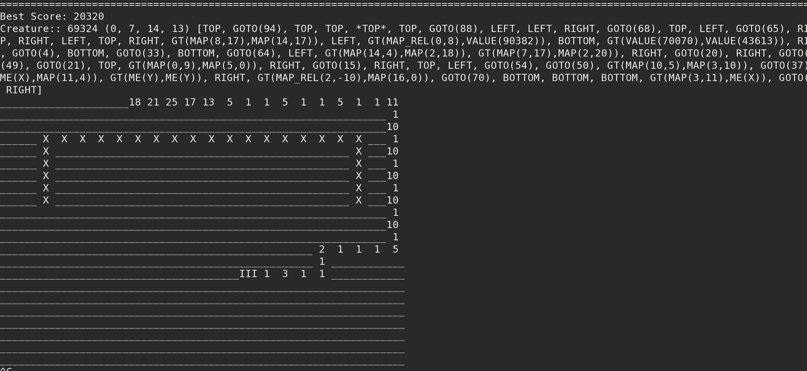

```
$ haxe build/build-test.hxml
$ ./cpp/Test-debug
```
In the screenshot bellow, the best bot of each turn is printed

* `Creature:: 94 (8, 21, 11, 8) [GT(VALUE())]...` is the genome of the bot
* in the map, `X` means wall
* `III` is where the bot started
* the number are the number of times the robot has been at this position


